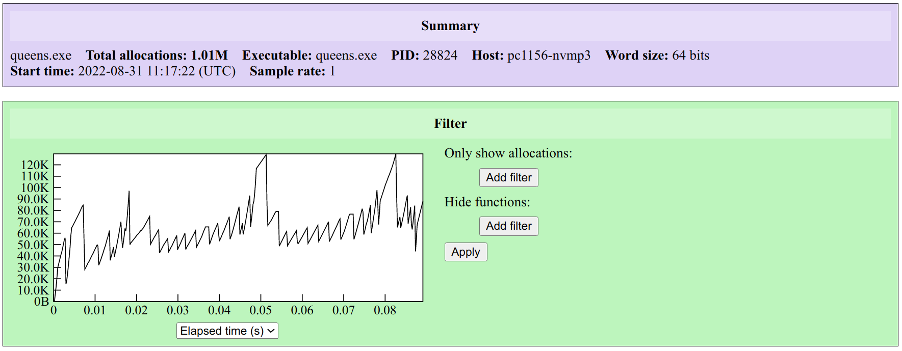
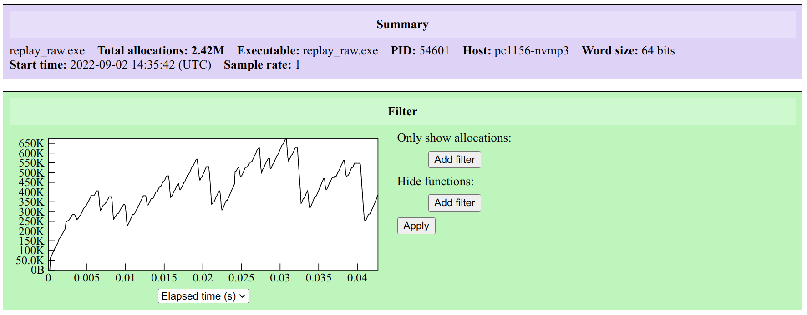
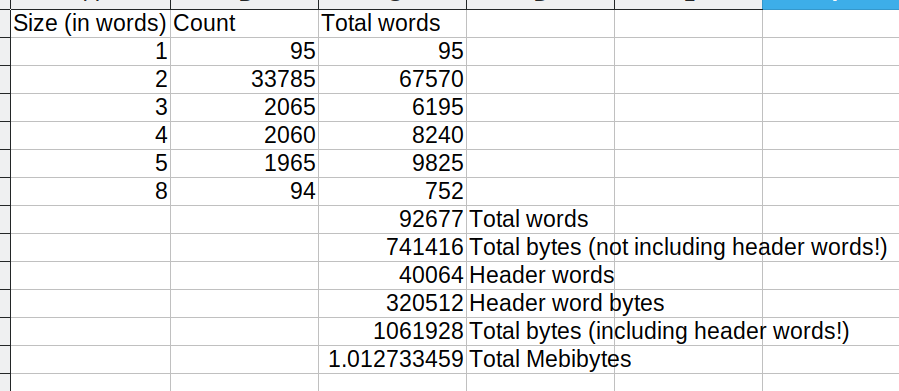
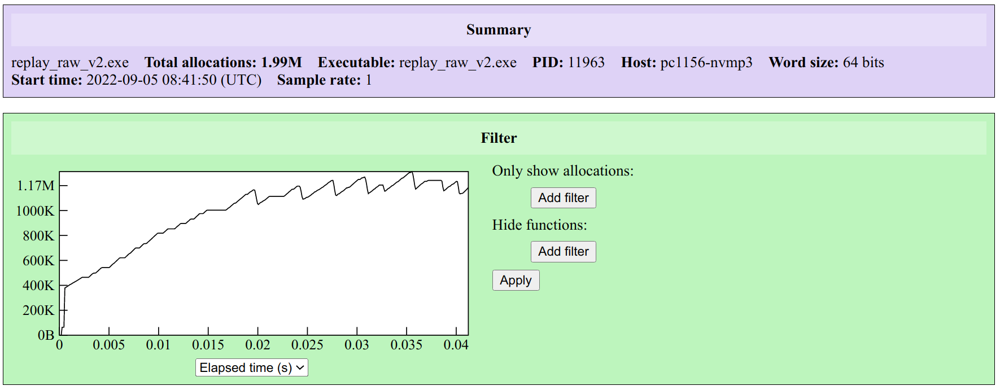
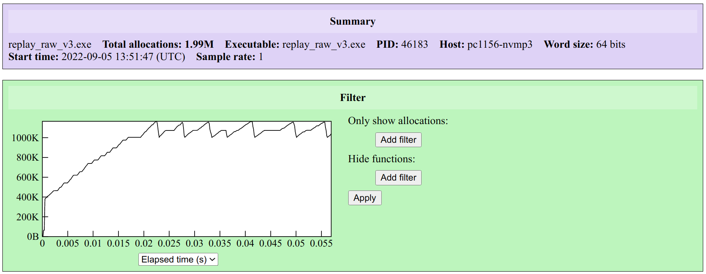
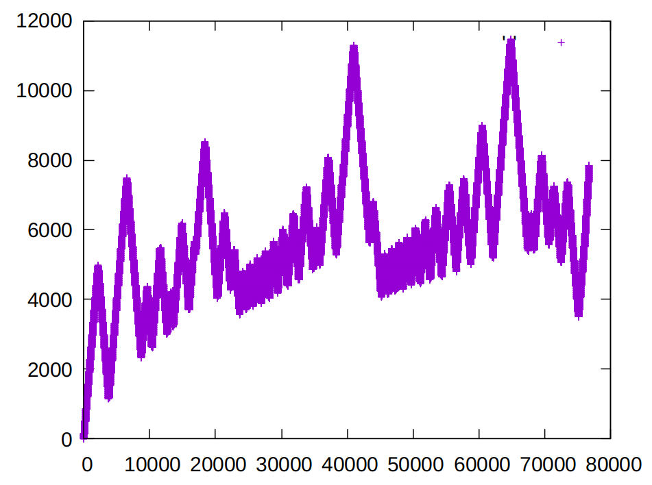
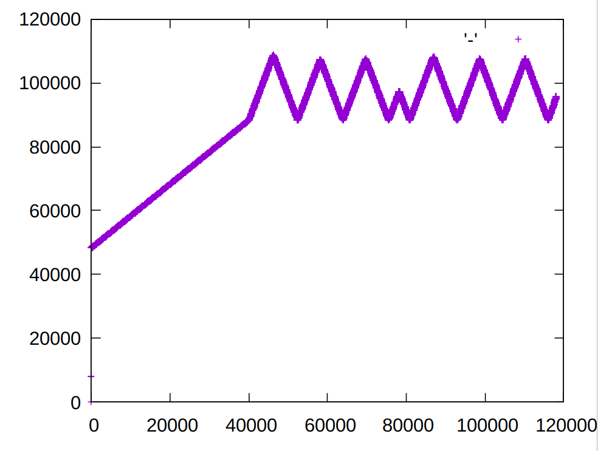

# ocaml-gc-events-tracing

Our overall goal with the code in this repository is to be able to profile different GC strategies in order to compare GC performance. 

**OCaml's GC: next-fit and best-fit:** Traditionally, OCaml's default GC implemented the next-fit strategy. There was a first-fit strategy implemented in 2008 (?) but this was largely unused. In 4.10.0 (Feb. 2020) a best-fit allocator was introduced as an option. For some (or even many) workloads, best-fit was found to be superior to next-fit (see [article from Stephen Dolan](https://blog.janestreet.com/memory-allocator-showdown/) for more information). In 4.13.0 (Sept. 2021) OCaml's default strategy was changed from next-fit to best-fit.

The upcoming OCaml 5 will ship with a form of next-fit adapted to multicore (also includes other improvements? FIXME). (FIXME Why next-fit rather than best-fit? Let's assume this was done because next-fit was easier to adapt to multicore.) It makes sense to consider porting best-fit to multicore. However, there is some doubt that the performance difference between next-fit and best-fit that was observed previously, will still hold for OCaml 5. (FIXME Why? Because of improvements to next-fit in OCaml 5? Because of the way OCaml 5 works, which mitigates the benefits of best-fit?). At this stage we would like to know whether or not a "best-fit GC for OCaml 5 multicore" is worth implementing (since the effort involved is likely large).

Let's assume that the next-fit that ships with OCaml 5 (call it next-fit5) is an improvement on next-fit in 4.14 and previously. The article by Stephen Dolan linked above compares the performance of next-fit and best-fit (presumably for some version of OCaml pre-4.14, but the comparison presumably still holds at 4.14). One thing we could do is to repeat the performance analysis for next-fit and best-fit (for 4.14) and then compare further with next-fit5. If next-fit5 improves on next-fit, and is comparable to best-fit in performance, then we probably don't need to reimplement best-fit for multicore OCaml.

FIXME a wrinkle here is that OCaml 5 has only next-fit5 as GC strategy; thus, we would seemingly be comparing OCaml 5 next-fit with 4.14 next-fit and 4.14 best-fit, which is not an apples-to-apples comparison. For example, it is possible that other changes in OCaml 5 impact the performance of next-fit5 to make it seem "better than 4.14 best-fit", and so be used to justify not implementing best-fit5, when in fact these other changes would similarly improve best-fit5. The problem is that we are trying to assess the potential performance of a putative best-fit5 without having the actual implementation. And anyway, a best-fit5 implementation may itself not show the same improvement in performance as shown in the Dolan article (perhaps the multicore adaptations mean that a putative best-fit5 no longer improves on next-fit5). 

---

Putting these concerns aside, the concrete task is to write a routine to serialize OCaml's [Gc.Memprof](https://v2.ocaml.org/api/Gc.Memprof.html) events to a file (a "trace file"), in order to facilitate performance comparisons between different GC implementations. FIXME how will such a tool be used to compare different GC implementations? FIXME exactly how will such a tool help to assess whether to implement a best-fit adapted for multicore?

In addition, we want a small program that consumes the trace and simulates the behaviour of the traced program. (FIXME how exactly does it do this? If it sees an alloc it simulates the same; for a dealloc it some how loses the ref to a previously alloc'ed block?)


## Memtrace and memtrace-viewer

Memtrace https://github.com/janestreet/memtrace is a "streaming client for OCaml's memprof". By setting an envvar, and inserting a single "start profiling" instruction into a "main" function in your OCaml application, memtrace will log all Memprof events to a trace file. This trace file can then be viewed by memtrace-viewer https://github.com/janestreet/memtrace_viewer. The trace file uses the "ctf" (Common Trace Format) file format, so is potentially also viewable using other tools. The viewer is described in a blog post https://blog.janestreet.com/finding-memory-leaks-with-memtrace/; the interface runs in a browser and looks basic, but the functionality is fairly sophisticated.


## Replaying a memtrace

We can use memtrace to record Gc.Memprof events (allocation on minor/major heap; promotion; collection from minor/major heap). We can then simulate (to a very rough extent) the memory behaviour, by reading the memtrace file: If we see an `Alloc` we can allocate an int array of the appropriate size, and stash this object in a hashtable, indexed by object id; if we see a `Collect` of a given object id, we can remove that object from the hashtable (thereby making it unreachable), and hope that GC (in the simulating runtime) collects the object in a timely manner. 

This approach is implemented in the `bin-replay/replay.exe` tool. 

We would, of course, want to validate that the simulated behaviour really does match the traced behaviour (at least as far as GC is concerned). A simple approach would be to attempt to memtrace the simulating program (i.e., `replay.exe`). However, memtrace itself performs a significant amount of allocation and deallocation while reading and iterating over the trace. The resulting "memtrace of the simulated memtrace" would include all these memtrace-internal memory events. In effect, we are no longer simulating _only_ the original traced behaviour, but instead have all the memtrace overhead.

One point of view is that we are only doing this to validate that replay is correctly simulating the original traced behaviour. So if we filter out all the allocs and deallocs due to memtrace, and ignore timings, we should get the "simulated behaviour without the memtrace overhead", which should be enough to confirm that `replay.exe` is working properly.

Another approach would be to avoid the use of memtrace when running replay. We might instead use a much simpler file format, which could be mmap'ed or read sequentially without any memtrace overhead. Then _that_ could be memtraced (since the overhead from memtrace iterating through the trace would not be present).


## Raw traces

The file `bin/translate_memtrace_to_raw.ml` contains a program that translates a memtrace file (Common Trace Format) to a simpler "raw" trace. The aim is to be able to replay the raw trace whilst avoiding all the allocations that occur when replaying a memtrace.

**Simple example:** The file `examples/simple/simple.ml` is a simple test program that does some allocations of int arrays, sized from 0 to 10. We use memtrace to create `simple.ctf`. The file `simple.ctf` is then translated to `simple.raw` using `translate_memtrace_to_raw.exe`. Note there is also a `simple.dump_trace` which is a human-readable version of `simple.ctf`. Finally, we use `bin/replay_raw.exe` to replay a raw trace. We use memtrace to trace this *replay*, and store the results in `replay_raw.ctf`. Again, the human-readable contents is in `replay_raw.dump_trace`.


## Comments on `replay_raw`

The file `replay_raw.ctf` is a trace of memory events when using `replay_raw.exe` to simulate the trace of `simple.exe`. How close does it get to simulating the original events?

* `replay_raw.exe` does some allocations when reading the trace file, and other allocations (eg creating the hashtable), when it starts. This makes the replay not a faithful reconstruction of the original events. (init-allocs)
* During the main loop of `replay_raw.exe`, there are calls to array.init (to simulate allocs); the resulting objects are then stored in a hashtable indexed by obj_id, to prevent them being collected immediately. This insertion into the hashtable causes extra allocations, and again makes the replay not a faithful reconstruction of the original events. (hashtbl-add-allocs)
* Consider `simple.ml`: After the objects are allocated by `simple.ml`, a GC is called; the objects are all reachable so none are collected, and instead they are all promoted to the major heap. The objects are then freed, and GC is called again. This time, all the objects are collected. In the replay, no collections happen, because all that is recorded is object allocations and deallocations. Allocations are simulated by allocating an appropriately sized array and keeping a global reference to it. Deallocations are simulated by just dropping the reference to the object, and expecting GC to collect the object. But if GC never runs, we won't see the collection in the replay. 

The problem is that memtrace records allocs, promotions and collects, but does not explicitly record where GC occurs, or what type of GC occurs. In the case of `simple.exe` we allocate very little, so the GC never kicks in and we never see the collects that were due to an explicit call to `Gc.full_major` in `simple.exe`.

**Scenarios where `replay_raw` performs well:** Let's ignore (init-allocs) and (hashtbl-add-allocs). Then `replay_raw.exe` allocates objects of the correct size in the correct order. It then unlinks these objects in the correct order. If a full GC runs, we expect this set of objects to be collected. If a GC slice runs, then maybe some objects that were collected in one slice in the SUT (the run of `simple.exe`), instead get collected in a later slice in the replay (because, for example, our simple replay code doesn't ensure that the objects are traversed by the GC in the same order that they were in the SUT). But statistically, we sort-of expect things to match up. We could confirm this by replaying another scenario, where lots of objects are allocated and deallocated, and GC kicks in automatically (not via explicit calls, as currently in `simple.exe`). In fact, we could use eg the js_of_ocaml-queue example to test this.

**Attempt to confirm behaviour of `replay_raw`, using `js_of_ocaml-queue.ctf` example:** The results are in gnuplot1.pdf and gnuplot2.pdf. Visually, these look completely different.


The topmost image is the original (including all objects, not just the queue-related objects as in Maurer's article). The one below is the simulation. The second graph seems to have many less lifetimes, presumably because the simulation is executing very quickly, and so multiple objects correspond to a single (x,y) lifetime coordinate.

Beyond that, in the top graph we see some banding - downward right bands, mostly short, before the final long band. In the bottom graph, there is some banding, but qualitatively this is completely different. 

Since our replay ignores times completely, we expect the replay to diverge from the original. But here there seems to be no real correspondence at all.

---

One obvious problem is that the `js_of_ocaml-queue.ctf` trace was collected in a completely different environment, and there is no reason to expect that GC during replay even uses the same algorithm as that used when the trace was recorded. So at the very least, we need to use a trace generated in the same environment as we use for the replay.

---

Before we do this, we can run some other checks on the replay and compare it to the original. So far we compared object lifetimes. We can instead compare the overall total used memory over time. memtrace-viewer can do this. For `js_of_ocaml-queue.ctf` we have:


For the replay we have:


Which reveals that even the very basic allocation pattern doesn't match, nor the totals, nor anything else. What is going on? We can write a simple script to summarize the allocations, giving the count of the number of allocations for each size. For `js_of_ocaml-queue.ctf` we get: 

```
size count
==== =====
1 159
2 225
3 62
4 168
5 265
6 19
7 14
8 1
9 5
12 2
14 1
32 1
39 1
64 1
465818 4
474300 11
474311 11
480135 2
604763 1
```

And for `replay_raw.ctf` we get: 

```
size count
==== =====
1 159
2 226
3 1016
4 172
5 265
6 21
7 14
8 1
9 5
12 2
14 1
32 2
39 1
64 3
128 2
8203 1
465818 4
474300 11
474311 11
480135 2
604763 1
```

These are actually pretty similar. The replay has a few more allocs at various sizes:

```
1	0
2	1
3	954
4	4
5	0
6	2
7	0
8	0
9	0
12	0
14	0
32	1
39	0
64	2
128	2
8203 1
```

In particular, the allocations of size 3 are likely due to (hashtbl-add-allocs). Other than this the allocations seem to match. If we compute the sum of the allocations (2022-09-02_replay_stats.ods), we get something like 110MB for the total bytes, whereas on the memtrace-viewer, we have 1.17G total allocated towards the end. So these figures don't agree. 

---

Let's narrow down variables: the environment (`js_of_ocaml-queue.ctf` was recorded a few years ago, on a different OCaml version, on a different machine, with a sample rate of 1e-6). So let's run the queens example, with sample rate 1.0. 



When we replay we get:



The allocation summaries are:

```
dune exec -- bin/alloc_summary.exe queens.ctf
                   
Object allocations:
size count
==== =====
1 95
2 33785
3 2065
4 2060
5 1965
8 94
dune exec -- bin/alloc_summary.exe replay_queens.ctf
                   
Object allocations:
size count
==== =====
1 95
2 33786
3 42130
4 2069
5 1965
6 7
8 94
32 1
64 2
128 2
256 2
512 2
1024 2
2048 2
4096 2
8203 1
```

Again, there are many (hashtbl-add-allocs) at size 3 in the replay.

Let's just check that these figures seem reasonable. For queens.ctf, we can use a spreadsheet to compute the following:



And the total 1.01MiB does agree with the summary provided by memtrace-viewer.

## `Replay_raw_v2`

One problem with `replay_raw` is that each time an object is created, it is added to the hashtable, which causes an allocation of size 3 during the trace. This potentially disturbs the replay GC, when compared to the GC behaviour of the original trace. An alternative would be to allocate an array (rather than a hashtable) right at the beginning of the replay. We can also allocate the references at the beginning too. The hope is that, by moving these replay overhead allocations to the start of the replay, the GC behaviour during the replay more closely matches the original trace. This is implemented in `replay_raw_v2`. 

The original trace, as viewed by memtrace-viewer:


The replay, via `replay_raw_v2`:



Clearly the replay does not resemble the original, even with the improvements of `replay_raw_v2`.


## Simulating minor heap collection: `replay_raw_v3`

OCaml has a generational GC. An object is typically allocated first on the minor heap, and when minor collection runs, the object is either collected, or promoted to the major heap. Within the memtrace trace, the events are: Alloc (for allocations), Collect (for collections) and Promote (for promotions from the minor heap to the major heap). With `replay_raw` and `replay_raw_v2` there is no attempt to simulate this minor heap: all objects are allocated as an OCaml array, and immediately linked into the object stash. When the corresponding Collect occurs, the object is unlinked from the stash, with the expectation that GC will then collect the object in a timely fashion. Promote events are ignored.

If we want to simulate the minor heap, we can do the following: During replay, when we create an object we only add it to the stash if we know it is later promoted. 

To implement this, we should consider another raw file format, with events: Alloc_minor, Alloc_then_promote. For each Alloc event in the memtrace, we can determine whether there is a subsequent Promote... if there is this should be recorded as Alloc_then_promote in the raw trace. (We can't directly simulate Promote events in the trace replay.)

---

This approach is implemented. The memtrace-viewer graph now looks like:



Again, this resembles the graph from `replay_raw_v2`, and does _not_ resemble the graph from the original trace. 


# Trace formats, translations, dumping and replays

The following formats are available:

* ctf - the original format supported by memtrace
* raw - a binary format with Alloc, Promote and Collect events; can be replayed with minimal additional allocs
* with_lookahead - a binary format like raw, but where the trace has been preprocessed in order to identify whether an alloc is collected from the minor heap or the major heap. Events are then Alloc_min, Alloc_maj, Collect_min, Collect_maj

It is possible to translate between these formats:

```
ctf  --(translate_memtrace_to_raw)--> raw
ctf  --(translate_with_promote_lookahead)--> with_lookahead
```

The program `dump.exe` can display traces in a plain text format. It can dump any of the 3 trace formats.

It is also possible to replay a trace. 

| Replay tool   | Trace format   | Notes                                                        |
| ------------- | -------------- | ------------------------------------------------------------ |
| replay        | ctf            |                                                              |
| replay_raw    | raw            |                                                              |
| replay_raw_v2 | raw            | Allocates an array to hold objects upfront. Requires command line argument to specify max object id in order to size the array. (This can obviously be improved.) |
| replay_raw_v3 | with_lookahead | As above, but uses the with_lookahead format.                |

FIXME rename raw and with_lookahead; rename replay tools; 

# Graph of total allocated, ignoring timestamps

The replay tool does not take account of timestamps: instead allocs and collects are simulated one after the other. In order to compare the behaviour of the replay against the original, it is worth plotting the total memory allocated for the original trace, but ignoring time (the allocs and collects are assumed to occur at a fixed interval). This is the program `bin/graph_mem.exe`. For the `queens.ctf` file, the output looks like:



This resembles the graph shown in memtrace-viewer, but should enable easier comparisons with the replayed trace. Unfortunately the replayed trace still looks completely different from the original:



Clearly something is very wrong with the replay tool - we would expect to see lots of minor collections, but here we seem to only see major collections.

